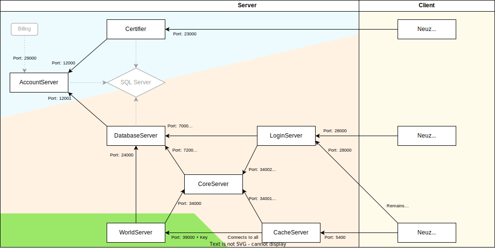

# Executable links and architecture

This graph shows the links between all executables and their cardinalities:

- Blue part, common to all your servers:
  - There is always one and only one AccountServer
  - You can have as much as Certifiers you want, but most of the time only one is required
- Orange part, for each server (Genese, Aurore, Clockworks, Kern, ...):
  - There is one DatabaseServer for each server you have
  - For each DatabaseServer, there is one and only one CoreServer, LoginServer and CacheServer, 
- Green part, for each channel:
  - There is one WorldServer for each channel you have (Genese Channel 1, Genese Channel 2, Aurore Channel 1, …)

## The purpose of each executable

- AccountServer: Manages the list of servers/channels and the connection of accounts to servers
- Certifier: Entry point when logging in the game. Neuz disconnects from it after the channel has been selected. Checks if the account and the password of the user are valid
- DatabaseServer: Perfoms the SQL queries related to a server (storing characters, etc)
- CoreServer: In memory features that are shared across all channels
- WorldServer: One channel, with its players, its monsters…
- LoginServer: Mostly used to process the player action on character select. The connection is maintained when playing
- CacheServer: Dispatches the packets sent by the player to the CoreServer and the player's WorldServer

- SQL Server is the database system.
- Billing port allows player to receive their cash shop items. Most likely, it is your website that will use it.
